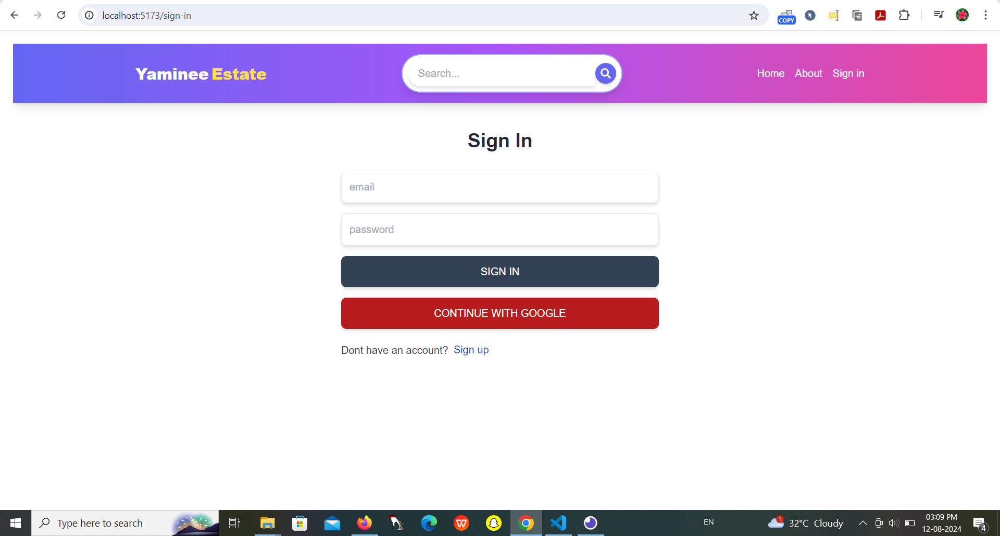
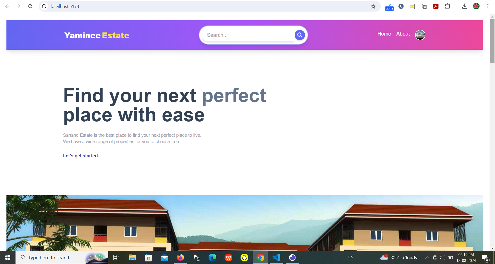
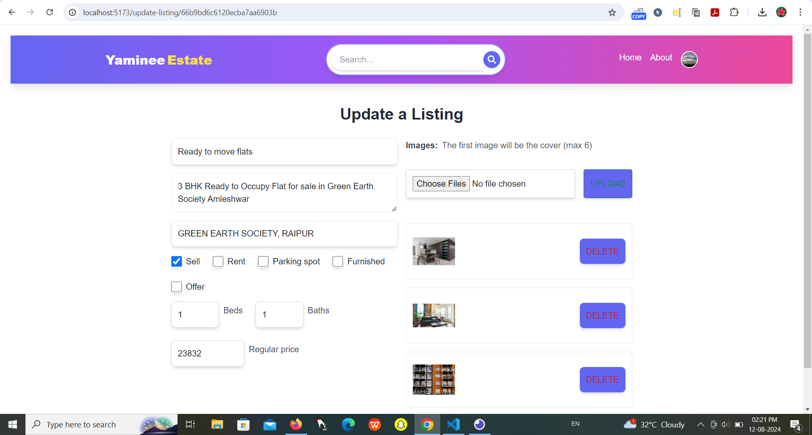
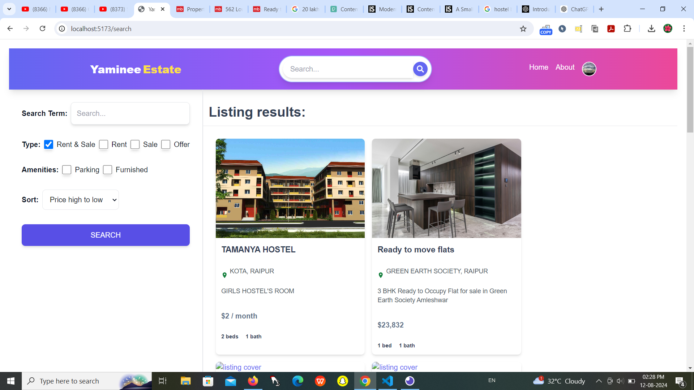
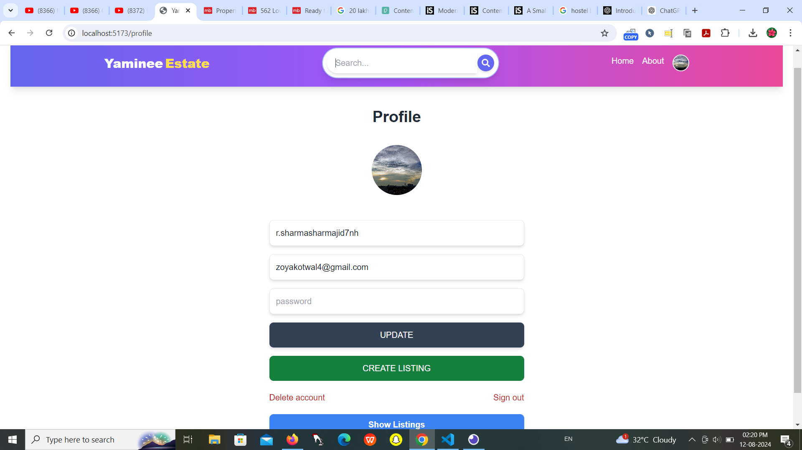

# **Yaminee Estate - Modern Real Estate Marketplace**

Welcome to **Yaminee Estate**, a cutting-edge real estate marketplace built from scratch using the MERN stack. This project is an enhanced version based on the comprehensive course, "Full-stack MERN Real Estate App: Build a Modern Marketplace."

## **Overview**
**Yaminee Estate** is a full-featured real estate platform where users can browse, search, and manage property listings. The project implements advanced features like JWT authentication, Firebase integration, Google OAuth, CRUD operations, and modern search functionality. It's designed to be user-friendly, secure, and scalable.

## **Features**
- **Authentication**:
  - JWT-based authentication for secure access.
  - Firebase integration for user management.
  - Google OAuth for seamless login experiences.

- **Property Listings**:
  - Full CRUD operations (Create, Read, Update, Delete) for managing property listings.
  - Image uploads for property visuals.
  - User-friendly interface for managing listings.

- **Search Functionality**:
  - Advanced search options to help users find properties based on various criteria.

- **Deployment**:
  - The application is deployed using the 'render' platform, making it accessible and easy to manage.

## **Technologies Used**
- **Frontend**:
  - React.js: For building the user interface.
  - Redux Toolkit: For state management.
  - Tailwind CSS: For styling and responsive design.

- **Backend**:
  - Node.js & Express.js: For building the server and API.
  - MongoDB: For the database, managing property listings and user data.
  - JWT (JSON Web Token): For secure authentication.

- **Others**:
  - Firebase: For user authentication and real-time features.
  - Google OAuth: For third-party login integration.
  - Render: For deployment of the application.

## **Installation**
Follow these steps to set up the project locally:

1. Clone the repository:
    ```bash
    git clone https://github.com/yourusername/yaminee-estate.git
    ```

2. Navigate to the project directory:
    ```bash
    cd yaminee-estate
    ```

3. Install server dependencies:
    ```bash
    cd backend
    npm install
    ```

4. Install client dependencies:
    ```bash
    cd ../frontend
    npm install
    ```

5. Set up environment variables:
    - Create a `.env` file in the `backend` directory with the necessary configurations (e.g., MongoDB URI, JWT secret, Firebase credentials).

6. Start the backend server:
    ```bash
    npm run dev
    ```

7. Start the frontend development server:
    ```bash
    cd ../frontend
    npm start
    ```

8. Open your browser and visit `http://localhost:3000` to view the application.

## **Screenshots**
Include screenshots of your application to showcase the interface:

- **SignIN Page**:
  
  
   **Home Page**:
  
  
- **Update Page**:
  
  
 - **Search**:
  
  
- **Profile Page**:
  

## **Contributing**
Contributions are welcome! Follow these steps to contribute:

1. Fork the repository.
2. Create a new branch (`git checkout -b feature-branch`).
3. Make your changes and commit them (`git commit -m 'Add new feature'`).
4. Push to the branch (`git push origin feature-branch`).
5. Open a Pull Request.

## **Contact**
For any questions, feedback, or suggestions, feel free to contact me at [yamineeshukla2000@gmail.com].
